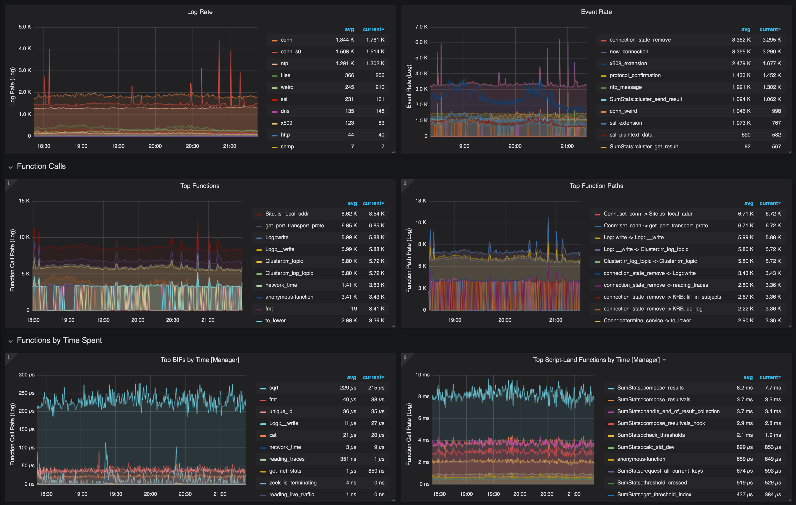

# Zeek Prometheus Exporter



This is a Zeek plugin which will track performance and health metrics in real-time, and run a web server which can
be scraped with [Prometheus](https://prometheus.io/).

# Overview

## Installation

### Install the Package

`$ zkg install zeek-exporter`

### Configure Binds and Scraping

The scripts will assign each node a unique port. For a single-system cluster, you should just need to redef the address it binds to:

`redef Exporter::bind_address = zeek.example.com;`

For a multi-box cluster, you can do something like:

```
@if ( Cluster::is_enabled() && gethostname() == "sensor1.example.com" )
redef Exporter::bind_address = 192.168.1.10;
@endif

@if ( Cluster::is_enabled() && gethostname() == "sensor2.example.com" )
redef Exporter::bind_address = 192.168.1.11;
@endif
```

A Prometheus scrape target example is available in [prometheus/target.yml](./prometheus/target.yml).

Scrapes can occur as often as you need, and you can track how long scrapes take in the `exposer_request_latencies` metric.
Our scrapes take about 0.2 seconds, and we scrape every 10 second, to detect some micro-bursts.

The cost of frequent scrapes is disk space on the Prometheus system, and increased memory/computation when generating the graphs.

A Grafana dashboard is included in [prometheus/dashboard.json](./prometheus/dashboard.json).

## How It Works

To get the necessary visibility, each node in a Zeek cluster will run this plugin and a Prometheus exporter.

Metrics are tracked individually for each node.

The plugin uses some of the available hooks to inspect function calls, log writes, and even itself and other plugin hooks.

## What It Can Measure

The following are instrumented at a high granularity:

* Scripts,
* Built In Functions (BIFs),
* Plugins implemented via hooks

## What It Can't Measure

While we have total CPU run-time, we don't have fine-grained visibility into:

* The core I/O loop,
* Protocol and file analyzers,

## What Impact Will This Have?

Don't know, but you can measure it!

On ESnet systems, the impact ranges from 0.05% to 15%. Workers are impacted most heavily, and the impact is determined by
the volume of event and function calls. The function call hook is the most expensive, adding about 2 microseconds to every
function call. However, on a very busy system, with > 100k calls/second, this will add up to 200ms each second.

# Advanced 

## Argument Labels

For increased visibility into some functions, simply having the function name isn't enough. For instance, for SumStats,
we'd like to be able to measure the cost of each SumStat (`detect-sqli-victims` versus `detect-ssh-bruteforcing`). To do this,
we augment the metrics with additional labels for Prometheus.

There's a Zeek option available, `Exporter::addl_functions` which allows you to define which events and functions to add labels for.

There are two labels available, `arg` and `addl`.
This supports the case of, for instance, for the `unknown_protocol` weird, grabbing the `addl` value telling you which protocol was unknown.

For more information, see the [Zeek script documentation](./docs).

## Detailed Metrics Information

### Wall-Clock and CPU Time


* `zeek_start_time_seconds` The epoch timestamp of when the process was started. Used to detect periodic crashes.

* `zeek_total_cpu_time_seconds`
   The total amount of CPU time spent in this process. This uses the standard library `clock()` function call, which returns
   an approximation. This can give an idea of how much "headroom" there is before more resources are needed.
   
   _Note_: The logger node runs multiple threads, which will result in an inaccurate count in most cases, as they get scheduled on different CPUs and execute in parallel.

### Number of Invocations


* `zeek_function_calls_total` The number of times Zeek functions were called, by function and parent function. This can be used to identify the most common execution path in scripts.

* `zeek_hooks_total` The number of times Zeek plugin hooks were called. This can be used to identify the most common execution paths in plugins.

* `zeek_log_writes_total` The number of log writes per log, writer and filter. This is mainly used to understand the network traffic profile.

### Function and Plugin Hook Durations, by Type

* `zeek_cpu_time_per_function_type_seconds` The amount of time spent in Zeek functions, by type.
    Types are Built In Functions (BIFs), and the three script-land function types: events, hooks, and functions.
    Note that script hooks are different from plugin hooks.
     
* `zeek_hook_cpu_time_seconds` The amount of time spent in Zeek plugin hooks, by hook name.
 
### Function Durations, by Function and Parent Function


There are two very similar metrics, one which includes execution time in child functions, and one which doesn't.

* `zeek_cpu_time_per_function_seconds` The amount of time spent in Zeek functions, by function and parent function. 
    Note that this includes the time any child functions take to execute, and as such will count those 
    executions multiple times when summed.

* `zeek_absolute_cpu_time_per_function_seconds` The "absolute" amount of time spent in Zeek functions. These
    metrics *do not* include the time spent in child functions, and thus will give valid data when summed.

